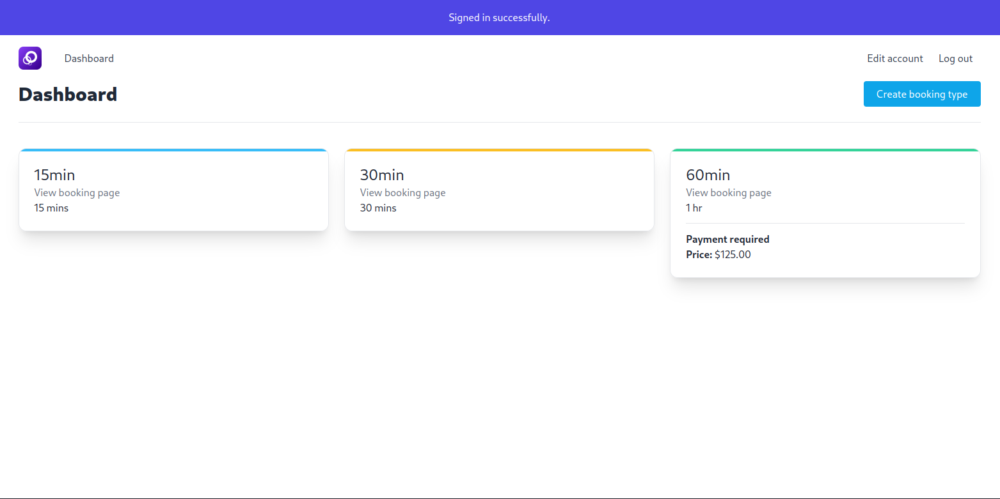
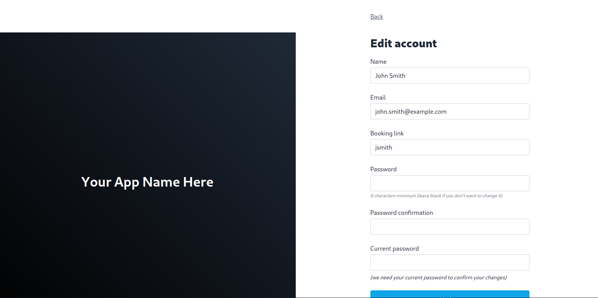
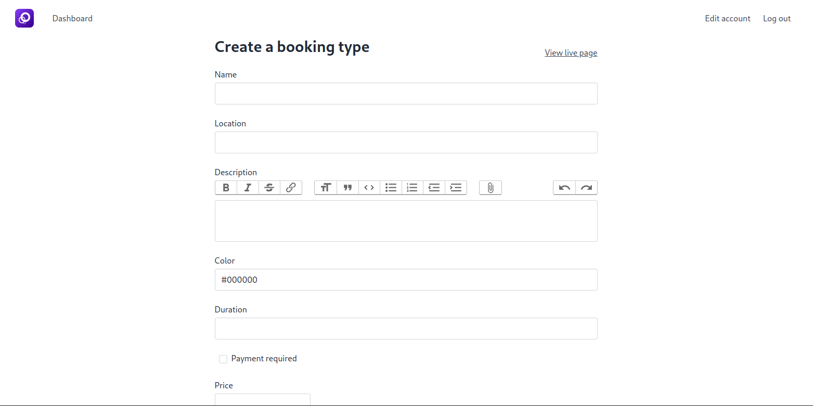
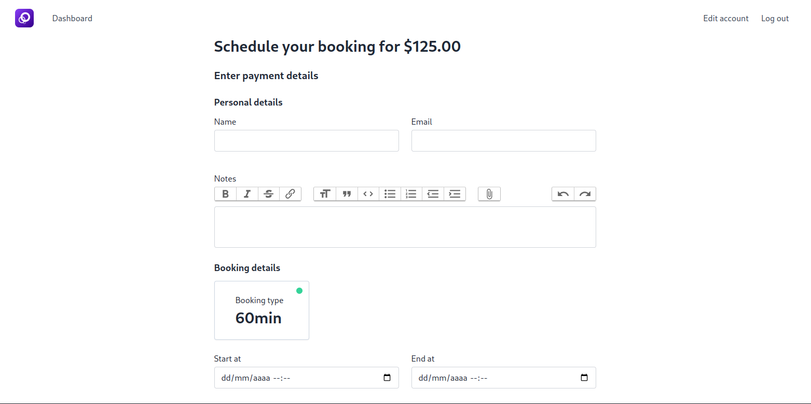

<p align="center">
  <a href="https://rubyonrails.org" target="blank"></a>
</p>

<p align="center">
  <a href="#-tecnologias">Tecnologias</a>&nbsp;&nbsp;&nbsp;|&nbsp;&nbsp;&nbsp;
  <a href="#-projeto">Projeto</a>&nbsp;&nbsp;&nbsp;|&nbsp;&nbsp;&nbsp;
  <a href="#-como-executar">Como executar</a>&nbsp;&nbsp;&nbsp;|&nbsp;&nbsp;&nbsp;
  <a href="#-licença">Licença</a>
</p>

<p align="center">
  
</p>

<br>

<a id="-tecnologias"></a>

## ✨ Tecnologias

Esse projeto foi desenvolvido com as seguintes tecnologias:


<a id="-projeto"></a>

## 💻 Projeto

O projeto BookMe é uma aplicação Web de agendamentos online, onde, de acordo com o tempo dessa consulta online, deve haver um sistema de pagamento ( de acordo com o horário que o usuário criou ) integrado com a API Stripe.

<p align="center">
  
</p>

<p align="center">
    
</p>

<p align="center">
  
</p>

<p align="center">
  
</p>

<a id="-como-executar"></a>

## 🚀 Como executar

### 💻 Pré-requisitos

Antes de começar, verifique se você atendeu aos seguintes requisitos:

- Você instalou a versão mais recente de `< Docker & Ruby>`

- Você tem uma máquina `< Windows / Linux / Mac >`.

- Você possui um `< Editor de código ou IDE / Gerenciador de banco de dados >`.

## Serviços necessários antes de rodar a aplicação:

Lembre-se de pegar as suas chaves de API nos serviços da API de pagamentos **[Stripe](https://www.googleadservices.com/pagead/aclk?sa=L&ai=DChcSEwijlrD54oX3AhUvQUgAHQb7CAsYABAAGgJjZQ&ohost=www.google.com&cid=CAASJeRopwqWu91WWsvPhM4UKeVdBrRdLP22hWD2ajMnUqih0kZrdnc&sig=AOD64_0Ww0E5pwd2EtlWshd1Y1RIipL_mg&q&adurl&ved=2ahUKEwiutan54oX3AhUNjZUCHaMFAqsQ0Qx6BAgDEAE).**

## ☕ Pequena ajuda

Preencha o arquivo `.env.example` com as informações cobradas e depois renomeie para `.env`.

```env
DATABASE_NAME=
DATABASE_USER=
DATABASE_PASSWORD=
DATABASE_HOST=
```

## Configurando o rails antes de iniciar :gear:

Primeiro, instale todas as Gems que são cobradas no GemFile:

```bash
bundle install
# se estiver configurado como produção
bundle install --without development test
```

Gere sua `master.key` para você não ter problemas de credenciais no rails:

```bash
rails credentials:edit
```

Agora, execute o comando abaixo para gerar o arquivo de configuração:

```bash
bundle exec figaro install
```

O arquivo será criado em `config/application.yml`, nesse arquivo siga o template abaixo para configurar as suas chaves de API

```yml
development:
  stripe_api_key: SUA_CHAVE_SECRETA_DO_STRIPE
  stripe_publishable_key: SUA_CHAVE_PUBLICA_DO_STRIPE

production:
  stripe_api_key: SUA_CHAVE_SECRETA_DO_STRIPE
  stripe_publishable_key: SUA_CHAVE_PUBLICA_DO_STRIPE
```

Agora, você tem o arquivo necessário para fazer o rails rodar com suporte ao stripe 😻

### Se lembre de ter o Docker rodando :ocean:

E então, rode o comando `docker-compose up --build -V`.

Se você quiser rodar o container em ambiente de produção `docker-compose -f ./docker-compose.prod.yml up --build -V`

Agora você pode acessar [localhost:3000](localhost:3000) do seu navegador.

<a id="licença"></a>

## 📄 Licença

Esse projeto está sob a licença MIT. Veja o arquivo [LICENSE](../LICENSE.md) para mais detalhes.

---

#### _Sinta-se livre para colaborar, toda ajuda é bem vinda ;)_
